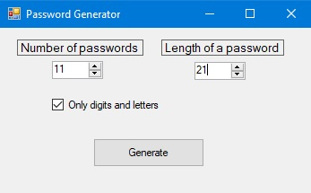
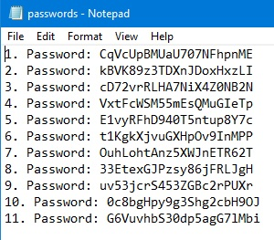

# Password Generator with GUI
A password generator using C# and Python. This simple project was made to train integration of Python into C#. I am going to expand functionality of this porgram.

# Usage
If you want to use it, download the archive on the folder "DOWNLOAD", unzip it where you want, run the executable, set settings, click Generate, then you will find "passwords.txt" file in "out" folder. You can enable "Only digits and letters" if you want a password constisting only of digits and letters

# Requirments
You need to install Python

# Screenshots

